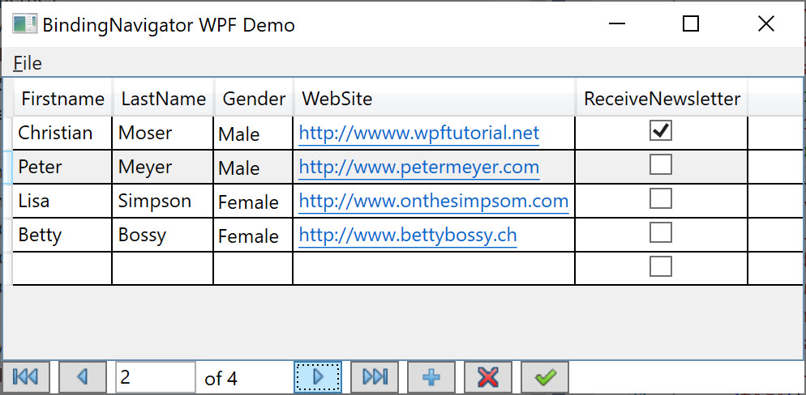

# BindingNavigatorWpf

I wondering when I can't find binding navigator for WPF as I like to use in WinForms.
So I decided to write my own and share it.

I oriented to my needs - binding navigator for related data grid with MVVM support.

I try to write it as simple as possible that anyone can understood and use it.

In addition there is the demo application. I plan to migrate all projects to .NET Core someday.

[ReleaseNotes](ReleaseNotes.md)

## How it look


Where is
1 - first item
2 - previous item
3 - current pos 1..n. Go to position <Enter>
4 - items count
6 - next item
6 - last item
7 - add item
8 - remove item
9 - save item

Buttons 7,8,9 could be hidden over XAML with attribute `VisibilityCommandName`

*Sample*
>VisibilitySave = "False"
>
>VisibilityDelete = "False"

### Demo application



## How to use

1. Reference BindingNavigator.dll
2. Add grid and binding navigator in XAML inside `DockPanel`. You can use any panel type but scrollbars is easy to get into DockPanel.
```XML
<DockPanel>
    <View:BindingNavigatorUc DockPanel.Dock="Bottom" DataContext="{Binding BindingNavigatorDataContext}"/>
    <DataGrid ItemsSource="{Binding Customers}" SelectedIndex="{Binding SelectedIndex}" SelectionChanged="Grid_OnSelectionChanged">
</DockPanel>
```
3. You to have define some properties in your view model:
```C#
  public BindingNavigatorViewModel BindingNavigatorDataContext
        {
            get
            {
                return mBindingNavigatorDataContext;
            }
            set
            {
                mBindingNavigatorDataContext = value;

            }
        }

        public ObservableCollection<CustomerItemUi> Customers
        {
            get
            {
                return mCustomers;
            }
        }

        public int SelectedIndex
        {
            get
            {
                return mSelectedIndex;
            }
            set
            {
                mSelectedIndex = value;
                OnPropertyChanged();
            }
        }
```

4. Default navigator implementation use `ObservableCollection` so define the data source as ObservableCollection
```C#
        private readonly ObservableCollection<CustomerItemUi> mCustomers = new ObservableCollection<CustomerItemUi>();
```

5. Create data manipulation class. Here is sample for `ObservableCollection`
```C#
   public class IssueItemDataChanger : IDataChanger
    {
        private readonly ObservableCollection<CustomerItemUi> mItems;

        public IssueItemDataChanger(ObservableCollection<CustomerItemUi> items)
        {
            mItems = items;
        }

        public object AddNew()
        {
            CustomerItemUi newItem = new CustomerItemUi ();
            mItems.Add(newItem);
            return newItem;
        }

        public void Delete(int viewPosition)
        {
            if (viewPosition >= 0 && viewPosition < mItems.Count)
            {
                mItems.RemoveAt(viewPosition);
            }
        }

        public void Save()
        {
            //TODO
        }
    }
```

6. Init BindingNavigator
```C#
IDataChanger dataChanger = new IssueItemDataChanger(mCustomers);
mViewDataManipulator = new ObservableCollectionDataManipulator<CustomerItemUi>(mCustomers, dataChanger);
mViewDataManipulator.SelectionChanged += DataManipulator_SelectionChanged;

mBindingNavigatorDataContext = new BindingNavigatorViewModel(mViewDataManipulator);
mBindingNavigatorDataContext.DataCount = mCustomers.Count;
mBindingNavigatorDataContext.CurrentPosition = 0;
```

7. Implement `DataManipulator_SelectionChanged` that you can sync binding navigator with grid position
```C#
        private void DataManipulator_SelectionChanged(object sender, int? selectionIndex)
        {
            if (selectionIndex.HasValue)
            {
                if (selectionIndex >= 0 && selectionIndex < mCustomers.Count)
                {
                    SelectedIndex = selectionIndex.Value;
                }
            }
        }
```
8. Implement Grid_OnSelectionChanged on view and ChangeSelection on view model that grid can sync row selection with navigator
```C#
        private void Grid_OnSelectionChanged(object sender, SelectionChangedEventArgs e)
        {
            object eOriginalSource = e.OriginalSource;
            //new selection
            IList addedItems = e.AddedItems;
            if (addedItems.Count > 0)
            {
                mViewModel.ChangeSelection(addedItems[0]);
            }
        }
```

```C#
        public void ChangeSelection(object selectedItem)
        {
            CustomerItemUi itemUi = selectedItem as CustomerItemUi;
            if (itemUi != null)
            {
                int selectedIndex = mCustomers.IndexOf(itemUi);

                if (selectedIndex >= 0)
                {
                    mViewDataManipulator.ToAbsolutePosition(selectedIndex);
                }
            }
        }
```
