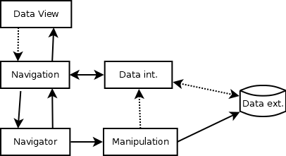
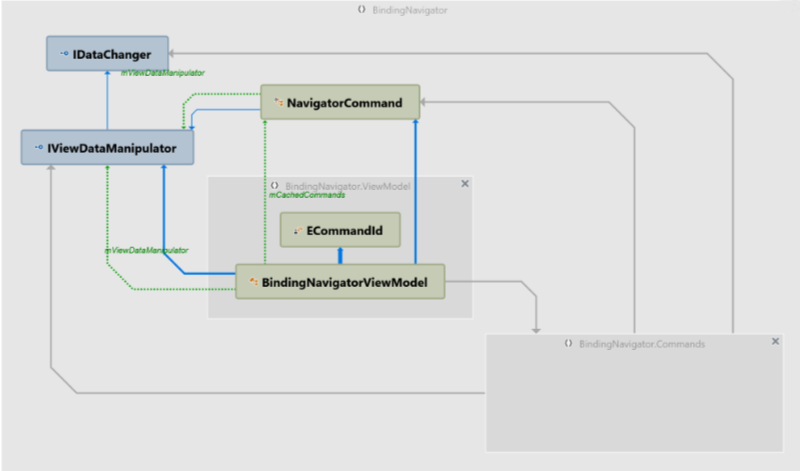
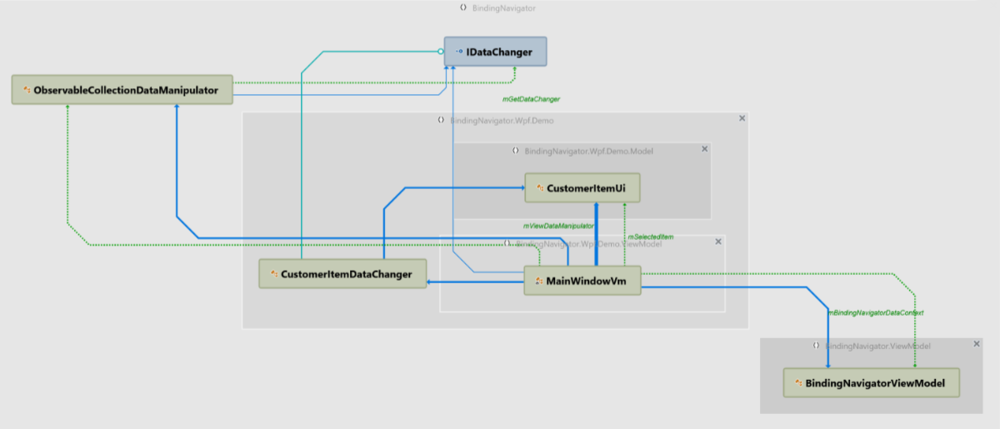

# Why library is so designed?

I want to have the solution which could work in most my use cases.
Often I use DataGrid as Data View and with navigator bottom of the view.
A data are stored into database or file but all data could be load into application memory.
If I use the grid for data visualization then I can navigate over all rows with keyboard or mouse, in that case I need to update my navigator state.

I can use navigator for changing row selection, in this case grid must update his selection state.
All navigation action don't need to know about the data structure.

But some action like, add, delete and save must know concrete data structure or have access to the external data management.
So this action must be defined for every specific project.

## Types hierarchy

So our design is reflected to the next classes/interfaces: `BindingNavigatorViewModel`, `IViewDataManipulator`, `IDataChanger`

I think it is better to look into demo application for class using

As you can see MainWindow view model used additional data class designed for view usage `CustomerItemUi`.
`CustomerItemDataChanger` could use this class by items adding and inherited from `IDataChanger`. In this class you can place any interaction logic with external data update.
`ObservableCollectionDataManipulation` class used by data navigation and getting of the `IDataChager` implementation.
All classes are connected over `BindingNavigatorViewModel`